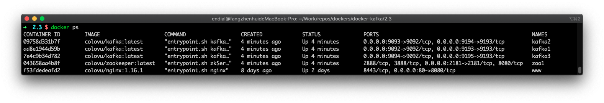

# Kafka

针对 Kafka 应用的 Docker 镜像，用于提供 Kafka 服务。

详细信息可参照官网：https://kafka.apache.org/


**版本信息**：

- 2.5、2.5.0、latest （Scala 2.12）
- 2.4、2.4.1 （Scala 2.12）
- 2.3、2.3.1 （Scala 2.12）

**镜像信息**

* 镜像地址：colovu/kafka:latest
  * 依赖镜像：colovu/openjdk:latest

**使用 Docker Compose 运行应用**

可以使用 Git 仓库中的默认`docker-compose.yml`，快速启动应用进行测试：

```shell
$ curl -sSL https://raw.githubusercontent.com/colovu/docker-kafka/master/docker-compose.yml > docker-compose.yml

$ docker-compose up -d
```


## 默认对外声明

### 端口

- 9092：Kafka 业务客户端访问端口

### 数据卷

镜像默认提供以下数据卷定义，默认数据存储在自动生成的应用名对应子目录中：

```shell
/var/log			# 日志输出，应用日志输出，非数据日志输出
/srv/conf			# 配置文件
/srv/cert			# 证书文件目录
/srv/datalog	# 数据操作日志文件
```

如果需要持久化存储相应数据，需要在宿主机建立本地目录，并在使用镜像初始化容器时进行映射。

举例：

- 使用宿主机`/host/dir/to/conf`存储配置文件
- 使用宿主机`/host/dir/to/log`存储日志文件

创建以上相应的宿主机目录后，容器启动命令中对应的数据卷映射参数类似如下：

```shell
-v /host/dir/to/conf:/srv/conf -v /host/dir/to/log:/var/log
```

使用 Docker Compose 时配置文件类似如下：

```yaml
services:
  kafka:
  ...
    volumes:
      - /host/dir/to/conf:/srv/conf
      - /host/dir/to/log:/var/log
  ...
```

> 注意：应用需要使用的子目录会自动创建。


## 使用说明

- 在后续介绍中，启动的容器默认命名为`kafka1`/`kafka2`/`kafka3`，需要根据实际情况修改
- 在后续介绍中，容器默认使用的网络命名为`app-tier`，需要根据实际情况修改


### 容器网络

在工作在同一个网络组中时，如果容器需要互相访问，相关联的容器可以使用容器初始化时定义的名称作为主机名进行互相访问。

创建网络：

```shell
$ docker network create app-tier --driver bridge
```

- 使用桥接方式，创建一个命名为`app-tier`的网络


如果使用已创建的网络连接不同容器，需要在启动命令中增加类似`--network app-tier`的参数。使用 Docker Compose 时，在`docker-compose`的配置文件中增加：

```yaml
services:
  kafka1:
    ...
    networks:
      - app-tier
  ...
```


### 下载镜像

可以不单独下载镜像，如果镜像不存在，会在初始化容器时自动下载。

```shell
# 下载指定Tag的镜像
$ docker pull colovu/kafka:tag

# 下载最新镜像
$ docker pull colovu/kafka:latest
```

> TAG：替换为需要使用的指定标签名


### 持久化数据存储

如果需要将容器数据持久化存储至宿主机或数据存储中，需要确保宿主机对应的路径存在，并在启动时，映射为对应的数据卷。

Kafka 镜像默认配置了用于应用配置的数据卷 `/srv/conf`及用于存储数据日志的数据卷`/srv/datalog`。可以使用宿主机目录映射相应的数据卷，将数据持久化存储在宿主机中。路径中，应用对应的子目录如果不存在，容器会在初始化时创建，并生成相应的默认文件。

> 注意：将数据持久化存储至宿主机，可避免容器销毁导致的数据丢失。同时，将数据存储及数据日志分别映射为不同的本地设备（如不同的共享数据存储）可提供较好的性能保证。


### 实例化服务容器

生成并运行一个新的容器：

```shell
 docker run -d --name kafka1 -e ALLOW_PLAINTEXT_LISTENER=yes  colovu/kafka:latest
```

- `-d`: 使用服务方式启动容器
- `--name kafka1`: 为当前容器命名
- `-e ALLOW_PLAINTEXT_LISTENER=yes`: 设置默认允许任意用户登录（调试时使用，生产系统应当使用认证）


使用数据卷映射生成并运行一个容器：

```shell
 $ docker run -d --name kafka1 -e ALLOW_PLAINTEXT_LISTENER=yes \
  -v /host/dir/to/datalog:/srv/datalog \
  -v /host/dir/to/conf:/srv/conf \
  colovu/kafka:latest
```


### 连接容器

启用 [Docker container networking](https://docs.docker.com/engine/userguide/networking/)后，工作在容器中的 Kafka 服务可以被其他应用容器访问和使用。

#### 命令行方式

使用已定义网络`app-tier`，启动 Zookeeper 容器：

```shell
$ docker run -d --name zoo1 -e ZOO_ALLOW_ANONYMOUS_LOGIN=yes \
	--network app-tier \
	colovu/zookeeper:latest
```

- `--network app-tier`: 容器使用的网络


使用已定义网络`app-tier`，启动 Kafka 容器：

```shell
$ docker run -d --name kafka1 -e ALLOW_PLAINTEXT_LISTENER=yes \
	--network app-tier \
  -e KAFKA_CFG_ZOOKEEPER_CONNECT=zoo1:2181 \
	colovu/kafka:latest
```

- `--network app-tier`: 容器使用的网络


创建新的 Kafka 容器作为客户端：

```shell
$ docker run -it --rm	--network app-tier \
  -e ALLOW_PLAINTEXT_LISTENER=yes \
  -e KAFKA_CFG_ZOOKEEPER_CONNECT=zoo1:2181 \
	colovu/kafka:latest kafka-topics.sh --list  --zookeeper zoo1:2181
```

- `--network app-tier`: 容器使用的网络


其他业务容器连接至 Kafka 容器：

```shell
$ docker run -d --name other-app --network app-tier --link kafka1:kafka -d other-app-image:tag
```

- `--link kafka1:kafka`: 链接 kafka1 容器，并命名为`kafka`进行使用（如果其他容器中使用了该名称进行访问）


#### Docker Compose 方式

如使用配置文件`docker-compose-test.yml`:

```yaml
version: '3.6'

services:
  zookeeper:
    image: 'colovu/zookeeper:latest'
    networks:
      - app-tier
    ports:
      - '2181'
    environment:
      - ZOO_ALLOW_ANONYMOUS_LOGIN=yes
  kafka1:
    image: 'colovu/kafka:latest'
    networks:
      - app-tier
    ports:
      - '9092'
    environment:
      - KAFKA_ZOOKEEPER_CONNECT=zookeeper:2181
      - ALLOW_PLAINTEXT_LISTENER=yes
  myapp:
    image: 'other-app-img:tag'
    links:
    	- kafka1:kafka
    networks:
      - app-tier
      
networks:
  app-tier:
    driver: bridge
```

> 注意：
>
> - 需要修改 `other-app-img:tag`为相应业务镜像的名字
> - 在其他的应用中，使用`kafka1`连接 Kafka 容器，如果应用不是使用的该名字，可以重定义启动时的命名，或使用`--links name:name-in-container`进行名称映射

启动方式：

```shell
$ docker-compose up -d -f docker-compose-test.yml
```

- 如果配置文件命名为`docker-compose.yml`，可以省略`-f docker-compose-test.yml`参数


#### 其他连接操作

使用 exec 命令访问容器ID或启动时的命名，进入容器并执行命令：

```shell
$ docker exec -it kafka1 /bin/bash
```

- `/bin/bash`: 在进入容器后，运行的命令


使用 attach 命令进入已运行的容器：

```shell
$ docker attach --sig-proxy=false kafka1
```

- **该方式无法执行命令**，仅用于通过日志观察应用运行状态
- 如果不使用` --sig-proxy=false`，关闭终端或`Ctrl + C`时，会导致容器停止


### 停止容器

使用 stop 命令以容器ID或启动时的命名方式停止容器：

```shell
$ docker stop kafka1
```

使用 Kafka 容器中`kafka-server-stop.sh`脚本停止容器：

```shell
$ docker exec -it kafka1 kafka-server-stop.sh
```


## 内部或外部客户端访问 Kafka

为了使用内部或外部的客户端访问 Kafka Brokers，需要配置不同的监听器。有关监听器的更多资料可参考 [this great article](https://rmoff.net/2018/08/02/kafka-listeners-explained/) 中的介绍。

可以在 Docker Compose 配置文件中增加类似参数：

```yaml
...
  ports：
    - '9092:9092'
    - '9093:9093'
  environment:
    ...
    - KAFKA_LISTENER_SECURITY_PROTOCOL_MAP=CLIENT:PLAINTEXT,EXTERNAL:PLAINTEXT
      - KAFKA_LISTENERS=CLIENT://:9092,EXTERNAL://:9093
      - KAFKA_ADVERTISED_LISTENERS=CLIENT://kafka:9092,EXTERNAL://localhost:9093
```


### 生产者与消费者使用内部客户端

客户端可以使使用`localhost`链接 kafka：

```shell
$ kafka-console-producer.sh --broker-list 127.0.0.1:9092 --topic test
$ kafka-console-consumer.sh --bootstrap-server 127.0.0.1:9092 --topic test --from-beginning
```


### 生产者与消费者使用外部客户端

客户端使用主机名链接 kafka：

```shell
$ kafka-console-producer.sh --broker-list kafka:9093 --topic test
$ kafka-console-consumer.sh --bootstrap-server kafka:9093 --topic test --from-beginning
```


## Docker Compose 部署

- KAFKA_ZOOKEEPER_CONNECT: 以逗号分隔的 Zookeeper 列表，格式为 `host:port`

### 单机部署

根据需要，修改 Docker Compose 配置文件，如`docker-compose.yml`，并启动:

```bash
$ docker-compose up -d
```

- 在不定义配置文件的情况下，默认使用当前目录的`docker-compose.yml`文件
- 如果配置文件为其他名称，可以使用`-f 文件名`方式指定


`docker-compose.yml`文件参考如下：

```yaml
version: '3.6'

services:
  zookeeper:
    image: colovu/zookeeper:latest
    environment:
    	- ZOO_ALLOW_ANONYMOUS_LOGIN=yes
    ports:
      - '2181:2181'
  kafka1:
    image: colovu/kafka:latest
    ports:
      - '9092:9092'
    environment:
      - KAFKA_ZOOKEEPER_CONNECT=zookeeper:2181
      - ALLOW_PLAINTEXT_LISTENER=yes
```


#### 环境验证


### 集群部署

根据需要，修改 Docker Compose 配置文件，如`docker-compose-cluster.yml`，并启动:

```bash
$ docker-compose -f docker-compose-cluster.yml up -d
```

- 在不定义配置文件的情况下，默认使用当前目录的`docker-compose.yml`文件


配置为 Kafka 集群后，单一机器的宕机不会影响服务的正常提供。建议是用奇数个主机组成集群。

可以使用 [`docker stack deploy`](https://docs.docker.com/engine/reference/commandline/stack_deploy/) 或 [`docker-compose`](https://github.com/docker/compose) 方式，启动一组服务容器。 `docker-compose.yml` 配置文件（伪集群）参考如下：

```yaml
version: '3.6'

services:
  zoo1:
    image: 'colovu/zookeeper:latest'
    container_name: zoo1
    ports:
      - 2181:2181
    environment:
      - ZOO_ALLOW_ANONYMOUS_LOGIN=yes
      - ZOO_LISTEN_ALLIPS_ENABLED=yes

  kafka1:
    image: 'colovu/kafka:latest'
    ports:
      - '9092:9092'
      - '9193:9193'
    container_name: kafka1
    environment:
      - KAFKA_ZOOKEEPER_CONNECT=zoo1:2181
      - KAFKA_BROKER_ID=1
      - ALLOW_PLAINTEXT_LISTENER=yes
      - KAFKA_LISTENER_SECURITY_PROTOCOL_MAP=INTERNAL:PLAINTEXT,CLIENT:PLAINTEXT
      - KAFKA_LISTENERS=INTERNAL://:9193,CLIENT://kafka1:9092
      - KAFKA_ADVERTISED_LISTENERS=INTERNAL://:9193,CLIENT://kafka1:9092
      - KAFKA_INTER_BROKER_LISTENER_NAME=INTERNAL
    depends_on:
      - zoo1

  kafka2:
    image: 'colovu/kafka:latest'
    ports:
      - '9093:9092'
      - '9194:9193'
    container_name: kafka2
    environment:
      - KAFKA_ZOOKEEPER_CONNECT=zoo1:2181
      - KAFKA_BROKER_ID=2
      - ALLOW_PLAINTEXT_LISTENER=yes
      - KAFKA_LISTENER_SECURITY_PROTOCOL_MAP=INTERNAL:PLAINTEXT,CLIENT:PLAINTEXT
      - KAFKA_LISTENERS=INTERNAL://:9193,CLIENT://kafka2:9093
      - KAFKA_ADVERTISED_LISTENERS=INTERNAL://:9193,CLIENT://kafka2:9093
      - KAFKA_INTER_BROKER_LISTENER_NAME=INTERNAL
    depends_on:
      - zoo1

  kafka3:
    image: 'colovu/kafka:latest'
    ports:
      - '9094:9092'
      - '9195:9193'
    container_name: kafka3
    environment:
      - KAFKA_ZOOKEEPER_CONNECT=zoo1:2181
      - KAFKA_BROKER_ID=3
      - ALLOW_PLAINTEXT_LISTENER=yes
      - KAFKA_LISTENER_SECURITY_PROTOCOL_MAP=INTERNAL:PLAINTEXT,CLIENT:PLAINTEXT
      - KAFKA_LISTENERS=INTERNAL://:9193,CLIENT://kafka3:9094
      - KAFKA_ADVERTISED_LISTENERS=INTERNAL://:9193,CLIENT://kafka3:9094
      - KAFKA_INTER_BROKER_LISTENER_NAME=INTERNAL
    depends_on:
      - zoo1
```

> 由于配置的是伪集群模式, 所以各个 server 的端口参数必须不同（使用同一个宿主机的不同端口）


#### 环境验证

使用`docker ps`命令，可以查看所有运行的容器（包含zoo1、kafka1、kafka2、kafka3）：



使用`docker exec -it container-name /bin/bash`命令进入容器，并执行创建 topic 操作:

```shell
$ kafka-topics.sh --zookeeper zoo1:2181 --create --topic test1 --replication-factor 3 --partitions 1
Created topic test1.
```

查看 Topic 信息：

```shell
$ kafka-topics.sh --zookeeper zoo1:2181 --describe --topic test1
Topic:test1	PartitionCount:1	ReplicationFactor:3	Configs:
	Topic: test1	Partition: 0	Leader: 2	Replicas: 2,1,3	Isr: 2,1,3
```

> 注意：当前信息 Replicas: 2,1,3	Isr: 2,1,3

生成一些消息（使用 Ctrl+C 终止）：

```shell
$ kafka-console-producer.sh --broker-list kafka2:9093 --topic test1
>1
>2
>3
>^C
```

停止 kafka3，在**宿主机**中执行命令：

```shell
$ docker stop kafka3
```

查看 Topic 信息：

```shell
$ kafka-topics.sh --zookeeper zoo1:2181 --describe --topic test1
Topic:test1	PartitionCount:1	ReplicationFactor:3	Configs:
	Topic: test1	Partition: 0	Leader: 2	Replicas: 2,1,3	Isr: 2,1
```

> 注意：当前信息 ISR 已变为 **Isr: 2,1**


## 容器配置

在初始化 Kafka 容器时，如果配置文件不存在，可以在命令行中使用相应参数对默认参数进行修改。类似命令如下：

```shell
$ docker run -d -e "KAFKA_ZOOKEEPER_CONNECT=zookeeper:2181" --name kafka1 colovu/kafka:latest
```


### 常规配置参数

常使用的环境变量主要包括：

#### `KAFKA_ZOOKEEPER_CONNECT`

默认值：**localhost:2181**。设置 Zookeeper 链接地址。

> 可以为多个 Zookeeper 服务器地址，使用逗号分隔。

#### `KAFKA_ZOOKEEPER_USER`

默认值：**无**。设置 Zookeeper 链接用户名，根据实际情况设置。

#### `KAFKA_ZOOKEEPER_PASSWORD`

默认值：**无**。设置 Zookeeper 链接用户密码，根据实际情况设置。

#### `KAFKA_ZOOKEEPER_CONNECTION_TIMEOUT_MS`

默认值：**6000**。设置 Zookeeper 链接超时时间。

#### `KAFKA_LISTENERS`

默认值：**PLAINTEXT://:9092**。设置默认的监听器。

#### `KAFKA_ADVERTISED_LISTENERS`

默认值：**PLAINTEXT://:9092**。设置发布Broker信息至Zookeeper的监听器，默认需要使用外部地址及端口。

#### `KAFKA_LISTENER_SECURITY_PROTOCOL_MAP`

默认值：**INTERNAL:PLAINTEXT,CLIENT:PLAINTEXT**。设置监听器加密方式。

> 以 Key/Value 形式配置的：
>
> - Key 为 Listener 的名称
> - Value 取值范围为：PLAINTEXT、SSL、SASL_PLAINTEXT、SASL_SSL

#### `KAFKA_AUTO_CREATE_TOPICS_ENABLE`

默认值：**true**。设置是否自动创建 Topics。

#### `ALLOW_PLAINTEXT_LISTENER`

默认值：**no**。设置是否允许匿名登录。

#### `KAFKA_CLIENT_USER`

默认值：**colovu**。设置客户端访问用户名。

#### `KAFKA_CLIENT_PASSWORD`

默认值：**pas4colovu**。设置客户端访问用户密码。

#### `KAFKA_INTER_BROKER_USER`

默认值：**colovu**。设置内部 broker 访问用户名。

#### `KAFKA_INTER_BROKER_PASSWORD`

默认值：**pas4colovu**。设置内部 broker 访问用户密码。

#### `ENV_DEBUG`

默认值：**false**。设置是否输出容器调试信息。

> 可设置为：1、true、yes


### 集群配置参数

使用 Kafka 镜像，可以很容易的建立一个 Kafka 集群。针对 集群模式，有以下参数可以配置：

#### `KAFKA_BROKER_ID`

默认值：**1**。介于1~255之间的唯一值，用于标识服务器ID。

#### `KAFKA_BROKER_ID_COMMAND`

默认值：**无**。用于生成ID的命令。

> KAFKA_BROKER_ID_COMMAND: "hostname | awk -F'-' '{print $$2}'"

在未定影 Broker ID时，会自动生成一个 ID 供容器使用，详细参见[文档](https://issues.apache.org/jira/browse/KAFKA-1070)。当使用这种方式时，可以支持容器的扩容或缩容。使用时，建议同时使用 Docker Compose的 `--no-recreate` 参数，保证容器的 ID 及容器名不会重复创建。


### 可选配置参数

如果没有必要，可选配置参数可以不用定义，直接使用对应的默认值，主要包括：

#### `KAFKA_BASE_DIR`

默认值：**/usr/local/kafka**。设置应用的默认基础目录。

#### `KAFKA_DATA_DIR`

默认值：**/srv/data/kafka**。设置应用的数据存储目录。

#### `KAFKA_DATA_LOG_DIR`

默认值：**/usr/local/kafka**。设置应用的数据日志存储目录。

#### `KAFKA_CONF_DIR`

默认值：**/srv/conf/kafka**。设置应用的配置文件目录。

#### `KAFKA_CONF_FILE`

默认值：**/srv/conf/kafka/server.properties**。设置应用的默认配置文件。

#### `KAFKA_CERT_DIR`

默认值：**/srv/cert/kafka**。设置应用的TLS证书存储目录。

#### `KAFKA_LOG_DIR`

默认值：**/var/log/kafka**。设置应用的默认日志目录。

#### `KAFKA_DAEMON_USER`

默认值：**kafka**。设置服务默认使用的系统用户。

#### `KAFKA_DAEMON_GROUP`

默认值：**kafka**。设置服务默认使用的系统用户组。

#### `KAFKA_PORT`

默认值：**9092**。设置服务默认的客户端访问端口。

#### `KAFKA_SOCKET_SEND_BUFFER_BYTES`

默认值：**102400**。设置 Socket 发送缓存大小。

#### `KAFKA_SOCKET_RECEIVE_BUFFER_BYTES`

默认值：**102400**。设置 Socket 接收缓存大小。

#### `KAFKA_SOCKET_REQUEST_MAX_BYTES`

默认值：**104857600**。设置 Socket 请求的最大字节数。

#### `KAFKA_TRANSACTION_STATE_LOG_REPLICATION_FACTOR`

默认值：**1**。

#### `KAFKA_TRANSACTION_STATE_LOG_MIN_ISR`

默认值：**1**。

#### `KAFKA_OFFSETS_TOPIC_REPLICATION_FACTOR`

默认值：**1**。

#### `KAFKA_NUM_PARTITIONS`

默认值：**1**。

#### `KAFKA_NUM_RECOVERY_THREADS_PER_DATA_DIR`

默认值：**1**。

#### `KAFKA_NUM_NETWORK_THREADS`

默认值：**3**。

#### `KAFKA_NUM_IO_THREADS`

默认值：**8**。

#### `KAFKA_GROUP_INITIAL_REBALANCE_DELAY_MS`

默认值：**0**。

#### `KAFKA_LOG_DIRS`

默认值：**/srv/datalog/kafka**。设置数据日志输出目录。

#### `KAFKA_LOG_SEGMENT_BYTES`

默认值：**1073741824**。

#### `KAFKA_LOG_FLUSH_INTERVAL_MESSAGES`

默认值：**10000**。

#### `KAFKA_LOG_FLUSH_INTERVAL_MS`

默认值：**1000**。

#### `KAFKA_LOG_RETENTION_HOURS`

默认值：**168**。

#### `KAFKA_LOG_RETENTION_BYTES`

默认值：**1073741824**。

#### `KAFKA_LOG_RETENTION_CHECK_INTERVALS_MS`

默认值：**300000**。

#### `JVMFLAGS`

默认值：**无**。设置服务默认的 JVMFLAGS。

#### `KAFKA_HEAP_SIZE`

默认值：**1024**。设置以 MB 为单位的 Java Heap 参数（Xmx 与 Xms）。如果在 JVMFLAGS 中已经设置了 Xmx 与 Xms，则当前设置会被忽略。


### SSL配置参数

使用证书加密传输时，相关配置参数如下：

#### `KAFKA_KEYSTORE_FILE`

默认值：**kafka.keystore.jks**。证书文件名，默认存放在容器中的`/srv/cert/kafka`目录。

#### `KAFKA_TRUSTSTORE_FILE`

默认值：**kafka.truststore.jks**。证书文件名，默认存放在容器中的`/srv/cert/kafka`目录。

#### `KAFKA_CERTIFICATE_PASSWORD`

默认值：**无**。证书秘钥。


### 应用配置文件

应用配置文件默认存储在容器内的`/srv/conf/kafka/`目录中。

#### 使用已有配置文件

Kafka 容器的配置文件默认存储在数据卷`/srv/conf`中，子路径为`kafka`。有以下两种方式可以使用自定义的配置文件：

- 直接映射配置文件

```shell
$ docker run -d --restart always --name kafka1 -v $(pwd)/server.properties:/srv/conf/kafka/server.properties colovu/kafka:latest
```

- 映射配置文件数据卷

```shell
$ docker run -d --restart always --name kafka1 -v $(pwd):/srv/conf colovu/kafka:latest
```

> 第二种方式时，本地路径中需要包含 kafka 子目录，且相应文件存放在该目录中


#### 生成配置文件并修改

对于没有本地配置文件的情况，可以使用以下方式进行配置。

##### 使用镜像初始化容器

使用宿主机目录映射容器数据卷，并初始化容器：

```shell
$ docker run -d --restart always --name kafka1 -v /host/path/to/conf:/srv/conf colovu/kafka:latest
```

or using Docker Compose:

```yaml
version: '3.1'

services:
  zookeeper:
    image: 'colovu/zookeeper:latest'
    ports:
      - '2181:2181'
    enviroment:
      - ALLOW_PLAINTEXT_LISTENER=yes
    volumes:
      - /host/path/to/conf:/srv/conf
```

##### 修改配置文件

在宿主机中修改映射目录`/host/path/to/conf`下子目录`kafka`中的配置文件（如 `server.properties`）。

##### 重新启动容器

在修改配置文件后，重新启动容器，以使修改的内容起作用：

```shell
$ docker restart kafka1
```

或者使用 Docker Compose：

```shell
$ docker-compose restart kafka1
```


## 安全

### 用户认证

Kafka 镜像默认禁用了无密码访问功能，在实际生产环境中建议使用用户名及密码控制访问；如果为了测试需要，可以使用以下环境变量启用无密码访问功能：

```shell
ALLOW_PLAINTEXT_LISTENER=yes
```


如果需要配置访问认证，需要配置相应的监听器参数，相关监听器主要有：

- INTERNAL: 用于 broker 内通讯
- CLIENT: 用于与在同一网络中的 消费者/生产者 通讯
- (optional) EXTERNAL: 用于与在不同网络中的 消费者/生产者 通讯


以下为一个客户端访问使用`SASL_SSL`方式，Broker 访问使用`SSL`方式，相应的配置参数:

```shell
KAFKA_LISTENER_SECURITY_PROTOCOL_MAP=INTERNAL:SSL,CLIENT:SASL_SSL
KAFKA_LISTENERS=INTERNAL://:9093,CLIENT://:9092
KAFKA_ADVERTISED_LISTENERS=INTERNAL://kafka:9093,CLIENT://kafka:9092
KAFKA_CLIENT_USER=user
KAFKA_CLIENT_PASSWORD=password
```

在上述配置中，**必须**使用相应的证书文件。相应的证书文件需要放在`/srv/cert/kafka`目录中（或主机映射数据卷时使用的目录中）。如果证书使用了密码保护，需要同时使用以下环境变量指定对应的密码：

```shell
KAFKA_CERTIFICATE_PASSWORD=myCertificatePassword
```

以下脚本可用于生成JKS证书文件:

* [kafka-generate-ssl.sh](https://raw.githubusercontent.com/confluentinc/confluent-platform-security-tools/master/kafka-generate-ssl.sh)

建议:

* 在使用密码时，建议相关证书都使用同一个密码。
* 将 CommonName 或 FQDN 设置为容器的 host那么，如： `kafka.example.com`。这样，在后续针对问题 "What is your first and last name?"，可以输入同样的名字。
* 在配置集群时，如果需要每个Broker使用不同的证书，需要重复相应的步骤，以生成不同的证书。

The following docker-compose file is an example showing how to mount your JKS certificates protected by the password `certificatePassword123`. Additionally it is specifying the Kafka container hostname and the credentials for the client and zookeeper users.

针对如何使用 JKS 证书（同时使用了 `certificatePassword123`密码保护）配置容器，以及如何配置容器 hostname ，举例如下：

```yaml
version: '3.6'

services:
  zookeeper:
    image: 'colovu/zookeeper:latest'
    ports:
     - '2181:2181'
    environment:
      - ZOO_ENABLE_AUTH=yes
      - ZOO_SERVER_USERS=kafka
      - ZOO_SERVER_PASSWORDS=kafka_password
  kafka:
    image: 'colovu/kafka:latest'
    hostname: kafka.example.com
    ports:
      - '9092'
    environment:
      - KAFKA_LISTENER_SECURITY_PROTOCOL_MAP=INTERNAL:SSL,CLIENT:SASL_SSL
      - KAFKA_ZOOKEEPER_CONNECT=zookeeper:2181
      - KAFKA_LISTENERS=INTERNAL://:9093,CLIENT://:9092
      - KAFKA_ADVERTISED_LISTENERS=INTERNAL://kafka.example.com:9093,CLIENT://kafka.example.com:9092
      - KAFKA_ZOOKEEPER_USER=kafka
      - KAFKA_ZOOKEEPER_PASSWORD=kafka_password
      - KAFKA_CLIENT_USER=user
      - KAFKA_CLIENT_PASSWORD=password
      - KAFKA_CERTIFICATE_PASSWORD=certificatePassword123
    volumes:
      - './kafka.keystore.jks:/srv/cert/kafka/kafka.keystore.jks:ro'
      - './kafka.truststore.jks:/srv/cert/kafka/kafka.truststore.jks:ro'
```

生产者与消费者在访问客户端使用数据时，需要同样提供对应的用户名及密码。

生产者使用加密方式访问时:

```shell
export KAFKA_OPTS="-Djava.security.auth.login.config=/srv/conf/kafka/kafka_jaas.conf"
kafka-console-producer.sh --broker-list 127.0.0.1:9092 --topic test --producer.config /srv/conf/kafka/producer.properties
```

消费者使用加密方式访问时：

```shell
export KAFKA_OPTS="-Djava.security.auth.login.config=/srv/conf/kafka/kafka_jaas.conf"
kafka-console-consumer.sh --bootstrap-server 127.0.0.1:9092 --topic test --consumer.config /srv/conf/kafka/consumer.properties
```


#### Kafka 的内部 Broker 访问配置

在内部 Broker 之间的通讯启用 `SASL`或 `SASL_SSL`认证时，可以使用以下参数配置:

* `KAFKA_INTER_BROKER_USER`: 内部 Broker 访问用户名
* `KAFKA_INTER_BROKER_PASSWORD`: 内部 Broker 访问用户密码

#### Kafka 的客户端访问配置

在与客户端的通讯启用 `SASL`或 `SASL_SSL`认证时，可以使用以下参数配置:

* `KAFKA_CLIENT_USER`: 客户端访问用户名
* `KAFKA_CLIENT_PASSWORD`: 客户端访问用户密码

#### Kafka 的 Zookeeper 访问配置

在与 Zookeeper 服务器的通讯启用 `SASL`或 `SASL_SSL`认证时，可以使用以下参数配置:

* `KAFKA_ZOOKEEPER_USER`: Kafka 用于访问 Zookeeper 的用户名
* `KAFKA_ZOOKEEPER_PASSWORD`: Kafka 用于访问 Zookeeper 的用户密码


## 日志

默认情况下，Docker 镜像配置为将容器日志直接输出至`stdout`，可以使用以下方式查看：

```bash
$ docker logs kafka1
```

使用 Docker Compose 管理时，使用以下命令：

```bash
$ docker-compose logs kafka
```


实际使用时，可以配置将相应信息输出至`/var/log`或`/srv/datalog`数据卷的相应文件中。配置方式使用 `KAFKA_LOG_DIRS` 类似如下在容器实例化时进行配置：

```shell
$ docker run -d --restart always --name kafka1 -e KAFKA_LOG_DIRS="/srv/datalog/kafka" colovu/kafka:latest
```

使用该配置后，相应的日志文件，将会存储在数据卷`/srv/datalog/kafka`的相应文件中。

容器默认使用的日志驱动为 `json-file`，如果需要使用其他驱动，可以使用`--log-driver`进行修改，详细说明请参见文档 [logging driver](https://docs.docker.com/engine/admin/logging/overview/) 中说明。


## 容器维护

### 容器数据备份

默认情况下，镜像都会提供`/srv/data`数据卷持久化保存数据。如果在容器创建时，未映射宿主机目录至容器，需要在删除容器前对数据进行备份，否则，容器数据会在容器删除后丢失。

如果需要备份数据，可以使用按照以下步骤进行：

#### 停止当前运行的容器

如果使用命令行创建的容器，可以使用以下命令停止：

```bash
$ docker stop kafka1
```

如果使用 Docker Compose 创建的，可以使用以下命令停止：

```bash
$ docker-compose stop kafka1
```

#### 执行备份命令

在宿主机创建用于备份数据的目录`/path/to/back-up`，并执行以下命令：

```bash
$ docker run --rm -v /path/to/back-up:/backups --volumes-from kafka1 busybox \
  cp -a /srv/data/kafka /backups/
```

如果容器使用 Docker Compose 创建，执行以下命令：

```bash
$ docker run --rm -v /path/to/back-up:/backups --volumes-from `docker-compose ps -q kafka1` busybox \
  cp -a /srv/data/kafka /backups/
```


### 容器数据恢复

在容器创建时，如果未映射宿主机目录至容器数据卷，则容器会创建私有数据卷。如果是启动新的容器，可直接使用备份的数据进行数据卷映射，命令类似如下：

```bash
$ docker run -v /path/to/back-up:/srv/data colovu/kafka:latest
```

使用 Docker Compose 管理时，可直接在`docker-compose.yml`文件中指定：

```yaml
zoo1:
	volumes:
		- /path/to/back-up:/srv/data
```


### 镜像更新

针对当前镜像，会根据需要不断的提供更新版本。针对更新版本（大版本相同的情况下，如果大版本不同，需要参考指定说明处理），可使用以下步骤使用新的镜像创建容器：

#### 获取新版本的镜像

```bash
$ docker pull colovu/kafka:TAG
```

这里`TAG`为指定版本的标签名，如果使用最新的版本，则标签为`latest`。

#### 停止容器并备份数据

如果容器未使用宿主机目录映射为容器数据卷的方式创建，参照`容器数据备份`中方式，备份容器数据。

如果容器使用宿主机目录映射为容器数据卷的方式创建，不需要备份数据。

#### 删除当前使用的容器

```bash
$ docker rm -v kafka1
```

使用 Docker Compose 管理时，使用以下命令：

```bash
$ docker-compose rm -v kafka1
```

#### 使用新的镜像启动容器

将宿主机备份目录映射为容器数据卷，并创建容器：

```bash
$ docker run --name kafka1 -v /path/to/back-up:/srv/data colovu/kafka:TAG
```

使用 Docker Compose 管理时，确保`docker-compose.yml`文件中包含数据卷映射指令，使用以下命令启动：

```bash
$ docker-compose up kafka1
```


## 注意事项

- 容器中启动参数不能配置为后台运行，只能使用前台运行方式，即：`daemonize no`
- 如果应用使用后台方式运行，则容器的启动命令会在运行后自动退出，从而导致容器退出


## 更新记录

- 2.5.0、latest
- 2.3.1


----

本文原始来源 [Endial Fang](https://github.com/colovu) @ [Github.com](https://github.com)
